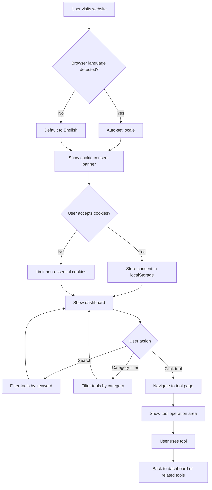

## 1. Product Overview
A self-hosted multi-tool aggregation website for global overseas users, featuring locale-first routing, unified navigation & UI, multi-language support (en/es/de/fr), and full EU GDPR compliance. Reference websites: ilovepdf.com, convertio.co, Futurepedia.io.

- Main purposes: Provide a centralized platform for developers and freelancers to access various web tools in one place
- Target users: Global overseas developers, freelancers, and tech professionals
- Market value: All-in-one tool station with clean UX, fast loading, and SEO-optimized for global reach

## 2. Core Features

### 2.1 User Roles
| Role | Registration Method | Core Permissions |
|------|---------------------|------------------|
| Guest User | No registration | Access all free tools, search, browse |
| Registered User | Email (future enhancement) | Save favorites, usage history |

### 2.2 Feature Modules
1. **Global Tool Dashboard**: Bento grid tool cards, category filtering, search, sort options
2. **Single Tool Page**: Core tool operation area, input/output UI, related recommendations
3. **i18n Internationalization**: Multi-language support with locale routing
4. **GDPR Compliance**: Cookie consent, privacy settings, legal pages
5. **Dark/Light Mode**: Theme switching with user preference persistence

### 2.3 Page Details
| Page Name | Module Name | Feature Description |
|-----------|-------------|---------------------|
| Dashboard | Header | Brand logo, search, category dropdown, language switcher, theme toggle |
| Dashboard | Sidebar | Collapsible category filter (Dev Tools, Image Tools, PDF Tools, Media Tools, Productivity) |
| Dashboard | Tool Grid | Bento grid layout, tool cards with icon, name, description, category tag, free/paid badge |
| Dashboard | Footer | Privacy Policy, Terms of Service, GDPR Cookie Settings, Sitemap, Github repo |
| Tool Page | Header | Same global header as dashboard |
| Tool Page | Left Sidebar | Back to dashboard, related tools recommendations |
| Tool Page | Center | Core tool operation area with clean input/output UI |
| Tool Page | Right Sidebar | Multi-language usage guide, feature introduction |
| Cookie Settings | Cookie Banner | Bottom consent banner with accept/reject options |
| Cookie Settings | Cookie Page | Dedicated page for adjusting cookie permissions |
| Legal Pages | Privacy Policy | Static page with English legal text |
| Legal Pages | Terms of Service | Static page with English legal text |

## 3. Core Process

## 4. User Interface Design

### 4.1 Design Style
- Primary color: #2563eb (blue)
- Secondary colors: Cool gray neutral palette
- Button style: Rounded 8px, subtle shadow, hover blue highlight
- Font: Inter (primary), JetBrains Mono (code tools)
- Layout: Clean card-based, minimalist overseas aesthetic
- Icon style: Lucide React icons, consistent 24px size

### 4.2 Page Design Overview
| Page Name | Module Name | UI Elements |
|-----------|-------------|-------------|
| Dashboard | Header | Flex layout, left logo, center search, right menu items |
| Dashboard | Tool Cards | Bento grid, icon top-left, title + description center, tag/badge bottom |
| Dashboard | Sidebar | Collapsible with chevron, category list with count badges |
| Tool Page | Operation Area | Input section with drag-drop, output section with preview/download |
| Cookie Banner | Banner | Fixed bottom, left text, right accept/reject buttons |

### 4.3 Responsiveness
- Desktop: 4-column grid, full sidebar visible
- Tablet: 2-column grid, sidebar collapsible
- Mobile: Single column, sidebar becomes hamburger menu

### 4.4 Animation
- Faint hover transition on cards (shadow + scale)
- Smooth page transitions
- Minimal loading states
