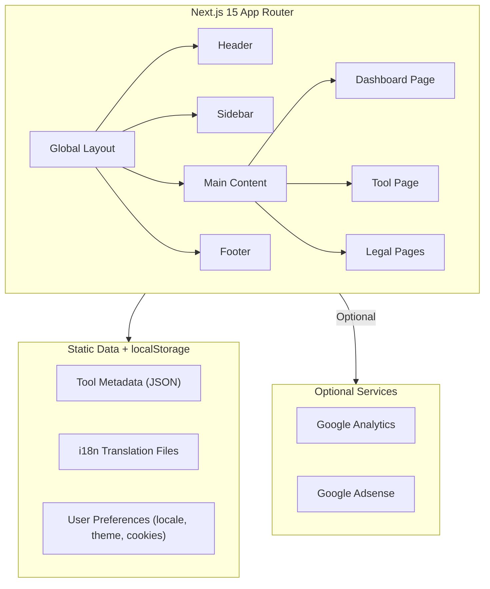

## 1. Architecture Design



## 2. Technology Description
- Frontend: Next.js 15 + React 18 + TypeScript
- Styling: Tailwind CSS 3 + ShadCN UI
- i18n: next-i18next + react-i18next
- Icons: Lucide React
- State Management: Zustand (for user preferences)
- Build: Vercel (static SSG generation)

## 3. Route Definitions

| Route | Purpose | File Path |
|-------|---------|-----------|
| /[locale]/ | Dashboard homepage | app/[locale]/page.tsx |
| /[locale]/tool/[slug] | Single tool page | app/[locale]/tool/[slug]/page.tsx |
| /[locale]/privacy | Privacy Policy | app/[locale]/privacy/page.tsx |
| /[locale]/terms | Terms of Service | app/[locale]/terms/page.tsx |
| /[locale]/cookies | Cookie Settings | app/[locale]/cookies/page.tsx |
| /[locale]/sitemap.xml | Sitemap | app/[locale]/sitemap.xml/route.tsx |

## 4. Data Model

### 4.1 Tool Metadata Structure
```typescript
interface Tool {
  id: string;
  slug: string;
  name: string;
  description: string;
  category: string;
  tags: string[];
  isFree: boolean;
  icon: string;
  relatedTools: string[];
}
```

### 4.2 Category Structure
```typescript
interface Category {
  id: string;
  name: string;
  icon: string;
  count: number;
}
```

### 4.3 Cookie Preferences
```typescript
interface CookiePreferences {
  necessary: boolean;
  analytics: boolean;
  advertising: boolean;
  consentDate: string;
}
```

## 5. Project Structure

```
.
├── app/
│   ├── [locale]/
│   │   ├── layout.tsx          # Global layout with i18n
│   │   ├── page.tsx            # Dashboard homepage
│   │   ├── tool/
│   │   │   └── [slug]/
│   │   │       └── page.tsx    # Single tool page
│   │   ├── privacy/
│   │   │   └── page.tsx
│   │   ├── terms/
│   │   │   └── page.tsx
│   │   └── cookies/
│   │       └── page.tsx
│   ├── layout.tsx              # Root layout
│   └── head.tsx                # Global head
├── components/
│   ├── Header.tsx              # Global header
│   ├── Footer.tsx              # Global footer
│   ├── Sidebar.tsx             # Dashboard sidebar
│   ├── ToolCard.tsx            # Tool card component
│   ├── CookieBanner.tsx        # Cookie consent banner
│   └── ThemeToggle.tsx         # Dark/light mode toggle
├── data/
│   ├── tools.ts                # Tool metadata
│   └── categories.ts           # Category definitions
├── public/
│   └── locales/
│       ├── en/
│       │   └── translation.json
│       ├── fr/
│       │   └── translation.json
│       ├── de/
│       │   └── translation.json
│       └── es/
│           └── translation.json
├── hooks/
│   └── usei18n.ts              # i18n hook
├── lib/
│   ├── i18n.ts                 # i18n configuration
│   └── cookies.ts              # Cookie management
├── stores/
│   └── preferences.ts          # User preferences store
└── utils/
    └── seo.ts                  # SEO utilities
```

## 6. i18n Configuration
- Default locale: en
- Supported locales: en, es, de, fr
- Locale detection: Browser language + localStorage fallback
- Translation files: public/locales/{lang}/translation.json
- Hreflang meta tags for SEO

## 7. GDPR Compliance
- Cookie consent banner on first visit
- Dedicated cookie settings page
- Privacy Policy and Terms of Service pages
- localStorage for consent tracking
