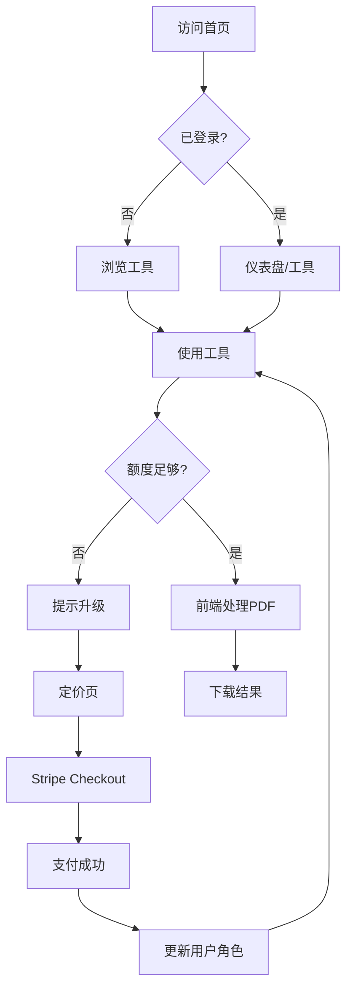

# 产品需求文档 (PRD) - PDF轻工具 SaaS

## 1. 产品概述
一款纯前端运行的轻量化PDF在线处理工具，所有PDF逻辑在浏览器本地完成，无需后端长连接和复杂服务器开销。对标 pdfcrowd.com，主打极简现代白色商务风格，支持PC与移动端自适应。
- 核心目标：为个人用户和小团队提供零上传、零等待、隐私安全的PDF处理体验
- 目标用户：设计师、工程师、学生、行政人员，需要快速处理PDF且关注隐私

## 2. 核心功能

### 2.1 用户角色
| 角色 | 注册方式 | 核心权限 |
|------|----------|----------|
| 访客 | 无需注册 | 使用基础工具，但受严格额度限制（单次1个文件，每日2次） |
| 免费用户 | 邮箱/社交登录 | 单次最多2个文件，每日5次限额 |
| Pro订阅用户 | Stripe订阅后 | 单次最多50个文件，每日500次，优先处理 |
| 终身用户 | 一次性购买 | 与Pro同等权限，永久有效 |

### 2.2 功能模块
1. **首页工具导航**：6大核心工具卡片入口、Hero区域、信任标识
2. **PDF压缩**：智能压缩算法，支持超大图纸（A0/A1）压缩，保持可读性
3. **PDF合并**：多文件拖拽排序合并，支持页码范围选择
4. **PDF拆分**：按页数/范围/单页拆分，支持批量下载
5. **PDF转Word**：基于pdf-lib文本提取，生成可编辑Word格式
6. **批量PDF图纸重命名**：差异化功能，支持正则、图纸编号、项目名称批量重命名
7. **定价页**：三档定价对比（免费/Pro月度/终身买断）
8. **登录/注册**：Supabase Auth，支持邮箱+密码、Google、GitHub
9. **用户仪表盘**：额度统计、使用历史、订阅管理、发票下载
10. **文件下载页**：处理结果展示、一键下载、重新处理

### 2.3 页面详情
| 页面名称 | 模块名称 | 功能描述 |
|----------|----------|----------|
| 首页 | Hero区域 | 大标题+动态背景+CTA按钮，突出"本地处理、隐私安全" |
| 首页 | 工具导航 | 6个工具卡片，hover动画，图标+简述 |
| 首页 | 信任区域 | 无上传、无服务器、隐私加密标语 |
| 工具页 | 文件上传区 | 拖拽上传、多文件选择、进度提示 |
| 工具页 | 参数设置 | 各工具专属配置（压缩率、页码范围等） |
| 工具页 | 处理结果 | 下载按钮、文件大小对比、重置 |
| 定价页 | 价格卡片 | 三栏对比，Pro卡片高亮，Stripe结账按钮 |
| 登录/注册 | 表单 | 邮箱验证、社交登录、密码重置 |
| 仪表盘 | 数据看板 | 环形图展示剩余额度、近期使用记录 |
| 下载页 | 结果展示 | 文件列表、批量打包下载、分享链接 |

## 3. 核心流程

### 3.1 访客使用流程
用户进入首页 → 选择工具 → 上传文件 → 前端本地处理 → 结果下载
如果超出访客限额（单次1个/每日2次），弹窗提示注册登录

### 3.2 登录用户使用流程
用户登录 → 首页选择工具 → 上传文件（最多2个）→ 前端处理 → 扣除额度 → 下载
当日超过5次时，提示升级Pro

### 3.3 Pro订阅流程
用户点击升级 → 定价页选择Pro/终身 → Stripe Checkout → 支付成功 → Supabase更新角色 → 返回仪表盘

## 4. 用户界面设计

### 4.1 设计风格
- **主色调**：纯白背景 (#FFFFFF) + 深灰文字 (#1F2937) + 蓝色强调 (#2563EB)
- **按钮风格**：圆角8px，主按钮蓝色填充，次按钮白色边框
- **字体**：系统无衬线字体栈（font-sans），标题加粗，正文常规
- **布局风格**：卡片式布局，顶部固定导航，内容区居中最大宽度1200px
- **图标风格**：Lucide React 线性图标，统一20px尺寸

### 4.2 页面设计概述
| 页面名称 | 模块名称 | UI元素 |
|----------|----------|--------|
| 首页 | Hero区域 | 居中布局，渐变背景动画，大标题48px，副标题20px，双CTA按钮 |
| 首页 | 工具网格 | 3x2网格卡片，圆角16px，阴影hover上浮，图标40px |
| 工具页 | 上传区域 | 虚线边框拖拽区，文件列表表格，进度条 |
| 定价页 | 价格卡片 | 三栏布局，中间Pro卡片放大高亮，勾选清单 |
| 仪表盘 | 数据卡片 | 顶部统计行，中部环形图，底部历史表格 |

### 4.3 响应式设计
- **PC端**：1200px最大宽度，导航横排，工具网格3列，定价3列
- **平板端**：768px-1199px，导航横排，工具网格2列，定价3列（缩小）
- **手机端**：<768px，汉堡菜单，工具网格1列，定价纵向堆叠，全宽按钮

## 5. SEO与Meta
- 每页独立title/description/keywords
- 首页关键词：PDF工具,在线PDF压缩,PDF合并,PDF拆分,PDF转Word,批量重命名PDF,本地处理PDF
- 使用Next.js 14 App Router的generateMetadata实现动态SEO
- 添加Open Graph和Twitter Card标签
