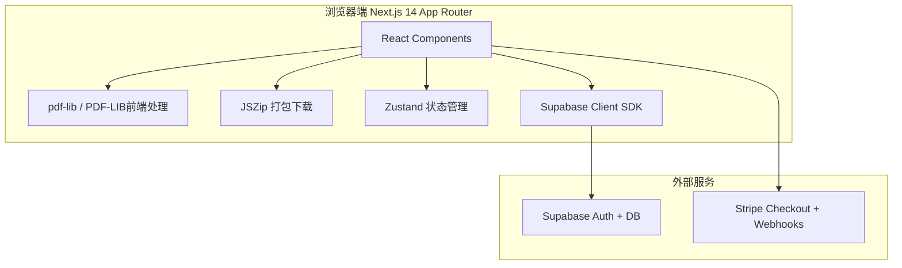
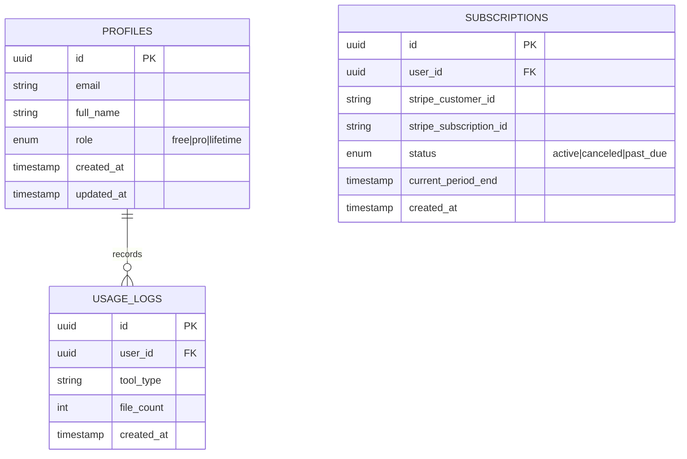

# 技术架构文档 - PDF轻工具 SaaS

## 1. 架构设计



## 2. 技术选型

| 层级 | 技术 | 版本/说明 |
|------|------|-----------|
| 框架 | Next.js | 14 (App Router, Static Export) |
| 语言 | TypeScript | strict模式 |
| 样式 | Tailwind CSS | 3.4+ |
| UI组件 | shadcn/ui | 基础组件库 |
| 图标 | lucide-react | 统一图标源 |
| 状态管理 | zustand | 轻量全局状态 |
| PDF处理 | pdf-lib | 纯前端PDF读写 |
| 压缩 | JSZip + file-saver | 前端打包下载 |
| 认证 | @supabase/supabase-js | 用户认证与数据 |
| 支付 | stripe-js + @stripe/stripe-js | 前端结账 |
| 数据验证 | zod | 表单与API校验 |

## 3. 路由定义

| 路由 | 用途 | 权限 |
|------|------|------|
| / | 首页，工具导航 | 公开 |
| /tools/compress | PDF压缩 | 公开（受额度限制） |
| /tools/merge | PDF合并 | 公开（受额度限制） |
| /tools/split | PDF拆分 | 公开（受额度限制） |
| /tools/to-word | PDF转Word | 公开（受额度限制） |
| /tools/rename | 批量重命名 | 公开（受额度限制） |
| /pricing | 定价页 | 公开 |
| /login | 登录 | 公开 |
| /register | 注册 | 公开 |
| /dashboard | 用户仪表盘 | 需登录 |
| /download | 文件下载页 | 需登录 |
| /api/stripe/webhook | Stripe webhook | 服务端API |
| /api/stripe/checkout | 创建结账会话 | 需登录 |

## 4. API 定义

### 4.1 Stripe相关API（Next.js API Routes）

```typescript
// POST /api/stripe/checkout
interface CheckoutRequest {
  priceId: string;  // Stripe Price ID
  mode: 'subscription' | 'payment';
}
interface CheckoutResponse {
  sessionId: string;
  url: string;
}

// POST /api/stripe/webhook
// Stripe webhook 事件处理，更新Supabase用户角色
```

### 4.2 额度检查（前端直接查Supabase）

```typescript
interface UserQuota {
  user_id: string;
  plan: 'free' | 'pro' | 'lifetime';
  daily_used: number;
  daily_limit: number;
  max_files_per_request: number;
  reset_at: string; // ISO日期
}
```

## 5. 数据模型

### 5.1 ER图



### 5.2 DDL (Supabase)

```sql
-- 用户配置表（扩展Supabase Auth）
create table profiles (
  id uuid references auth.users on delete primary key,
  email text unique not null,
  full_name text,
  role text check (role in ('free', 'pro', 'lifetime')) default 'free',
  daily_used integer default 0,
  daily_limit integer default 5,
  max_files_per_request integer default 2,
  reset_at date default current_date,
  created_at timestamptz default now(),
  updated_at timestamptz default now()
);

-- 使用记录表
create table usage_logs (
  id uuid default gen_random_uuid() primary key,
  user_id uuid references profiles(id) on delete cascade not null,
  tool_type text not null,
  file_count integer default 1,
  created_at timestamptz default now()
);

-- 订阅表
create table subscriptions (
  id uuid default gen_random_uuid() primary key,
  user_id uuid references profiles(id) on delete cascade unique not null,
  stripe_customer_id text,
  stripe_subscription_id text,
  status text check (status in ('active', 'canceled', 'past_due')) default 'active',
  current_period_end timestamptz,
  created_at timestamptz default now()
);

-- 安全策略：用户只能读写自己的数据
alter table profiles enable row level security;
alter table usage_logs enable row level security;
alter table subscriptions enable row level security;

create policy "Users can view own profile"
  on profiles for select using (auth.uid() = id);

create policy "Users can update own profile"
  on profiles for update using (auth.uid() = id);

create policy "Users can view own usage logs"
  on usage_logs for select using (auth.uid() = user_id);

create policy "Users can insert own usage logs"
  on usage_logs for insert with check (auth.uid() = user_id);

create policy "Users can view own subscription"
  on subscriptions for select using (auth.uid() = user_id);
```

## 6. 额度系统逻辑

### 6.1 检查与重置
- 每次使用工具前，查询profiles表的daily_used和reset_at
- 如果reset_at < 当前日期，重置daily_used = 0，reset_at = 当前日期
- 如果daily_used >= daily_limit，拦截并提示升级

### 6.2 角色权限映射
| 角色 | daily_limit | max_files_per_request |
|------|-------------|----------------------|
| free | 5 | 2 |
| pro | 500 | 50 |
| lifetime | 500 | 50 |

## 7. Stripe 集成流程

1. **产品配置**：在Stripe后台创建两个产品（Pro月度$9.99、终身$29）
2. **结账**：前端调用`/api/stripe/checkout`，创建Checkout Session，跳转Stripe
3. **支付成功**：Stripe webhook推送`checkout.session.completed`
4. **更新角色**：API路由接收webhook，验证签名，更新profiles.role和subscriptions表
5. **取消订阅**：通过Customer Portal管理，webhook更新subscriptions.status

## 8. 部署架构

- **平台**：Vercel（Next.js原生支持）
- **数据库/Auth**：Supabase免费 tier
- **支付**：Stripe
- **无服务器端状态**：纯Serverless Functions处理webhook
- **静态导出**：使用`output: 'export'`实现纯静态部署，API Routes作为Vercel Functions运行

## 9. 环境变量清单

```bash
# Supabase
NEXT_PUBLIC_SUPABASE_URL=https://your-project.supabase.co
NEXT_PUBLIC_SUPABASE_ANON_KEY=your-anon-key
SUPABASE_SERVICE_ROLE_KEY=your-service-role-key

# Stripe
NEXT_PUBLIC_STRIPE_PUBLISHABLE_KEY=pk_test_...
STRIPE_SECRET_KEY=sk_test_...
STRIPE_WEBHOOK_SECRET=whsec_...

# App
NEXT_PUBLIC_APP_URL=https://your-domain.vercel.app
```
